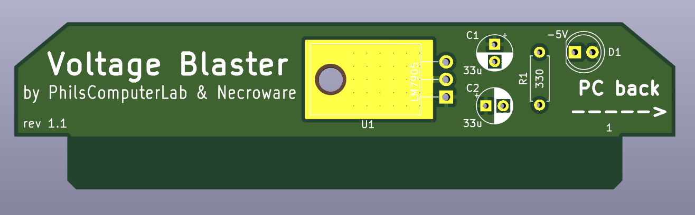

# Voltage Blaster

Voltage Blaster is a very simple circuit, which provides -5V through ISA slot
for systems with power supply which don't provide such voltage. It was created
in cooperation of PhilsComputerLab with Necroware.

# Why do I need this?

Back in the days of XT and AT compatible computers the standard power supply had
to provide 5V, 12V, -12V and -5V. A lot of hardware, especially sound cards,
needed -5V to work properly. This voltage was provided for the ISA expansion
cards on the pin B5. As time passed, AT systems and compatible power supplies
were replaced by ATX. In the beginning they also provided -5V, but then less and
less expansion cards needed such voltage and as soon as ISA was considered 
obsolete, ATX standard eventually dropped -5V rail requirement. Today it is not
possible to buy a new AT power supply, but ATX power supplies can be used
through an adapter. However, since almost none of the modern ATX power supplies
will provide -5V, you could run into problems, when trying to use an old ISA
expansion card, which needs this voltage. Famous examples are Creative Sound
Blaster 2.0, Pro Audio Spectrum sound cards and many others. This is where the
Voltage Blaster comes into play.

# How does it work?

All voltage pins in the ISA slots are directly connected to each other and to
the PSU. When using a PSU without -5V support, the ISA slot pin B5 is just
floating. The idea behind the Voltage Blaster is very simple. What if one of the
ISA expansion cards will provide -5V and feed it through the ISA slot in
reverse. Well since the ISA slot pin B7 provides -12V, it's just a matter of
using a linear voltage regulator LM7905 and connect its output to the pin B5 of
the ISA slot.

# Bill of materials

Reference  |#  |LCSC   |Description
-----------|---|-------|-------------------------------------
U1         | 1 |C427634| linear voltage regulator LM7905
C1,C2      | 2 |C3314  | electrolytic capacitor 33µF
D1         | 1 |C99697 | light emitting diode (optional)
R1         | 1 |C58608 | resistor 330 Ohm (optional)

Parts D1 and R1 are optional and are only required if you want that the diode is
lighting, when -5V are generated.

